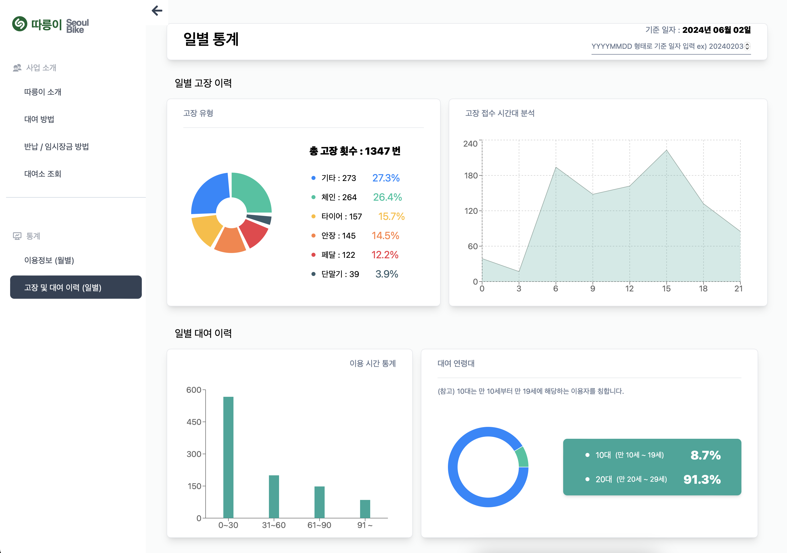

# 자전거 Dashboard | OPEN API 기반 데이터 시각화


#### 사이트 링크 : <a href="https://dashboard-v2-coral.vercel.app">https://dashboard-v2-coral.vercel.app</a>

<br/><br/>

# 01. 프로젝트 정보

### (1) 프로젝트 제목
서울시 공공데이터와 카카오 맵 API를 사용한 데이터 도식화
<br><br>

### (2) 프로젝트 소개
대학 졸업 논문을 작성하면서 설문 조사에 대한 통계나 다른 논문의 실험 결과에 대한 통계를 내야하는 상황이 많았다. 여러 상황 속에서 느낀 것은 텍스트로 데이터를 이해하는 것과 표나 그림 등 시각 자료로 데이터를 접할 때의 이해도에 큰 차이가 있다는 점이었다. 이 경험을 토대로 open api를 통해 데이터를 시각화 하는 프로젝트를 설계하게 되었다. 사용한 Open API는 서울시의 공공자전거이용정보와 카카오의 지도 API이다. 단순 데이터를 시각화 하는 것에서 그치지 않고, 데이터를 가공해서 유의미한 자료를 제공할 수 있는 방안에 대해서 끊임 없이 고민한 프로젝트이다. 
<br><br>

### (3) 개발 기간
2024-01-29 ~ 2024-02-06
<br><br>

### (4) 기술 스택
#### Environment


#### Config


#### Development
 


<br><br><br>

# 02. 시작 가이드

### Installation
```
$ git clone https://github.com/yebinp1102/Dashboard.git
```
<!-- .env.local -->

### Execution 
```
$ npm install
$ npm run dev
```

### env.local 설정
```
VITE_API_KEY = "486b424c5a79656232354365444767"
```

<br><br><br>

# 03. 페이지 구성 


|  홈페이지 |  이용방법  |
|:-------:|:--------:|
| ![home] | ![usage] |

| 대여소 검색 | 일별 통계  |
|:--------:|:--------:|
| ![search]|  ![day]  |

| 월별 통계 |
|:-------:|
| ![month]|

<br><br><br>

# 04. 주요 기능

⭐️ 근처 대여소 검색 및 잔여 자전거 개수 조회
- 검색 창에 강남, 논현, 노량진 등 서울 주소 입력 시, 경•위도 ± 0.009 범위(≒ 약 1 정거장 거리)에 있는 대여소를 검색한다.
- 범위 내에 있는 대여소의 위치는 지도의 마커로 표시된다. 
- 각 대여소 별 잔여 자전거 갯수를 출력한다.
- 서울시 공공자전거에 대한 통계이기 때문에 부산과 같은 타지역을 입력시 아무런 데이터도 반환하지 않는다.

⭐️ 일별 통계 
- 날짜별 고장 내용, 고장 접수 시간대, 대여 연령, 이용 시간 통계를 도식화 한다.
- 사용자가 원하는 날짜를 YYYYMMDD 형태로 입력하면 해당 날짜의 통계를 보여준다.

⭐️ 월별 통계 
- 총 대여 건수, 평균 이용 시간, 평균 이용 거리, 탄소 절감량, 가장 대여가 많았던 대여소 탑 5에 대한 자료를 도식화 한다.
- 2023년 8, 9, 10, 11, 12 월 중 통계 기준을 선택 할 수 있다.


<br><br><br>

# 05. 성과 및 배운점
✅ 브라우저의 뷰포트(viewport)에 따라 flex, grid 속성을 변경하는 반응형 레이아웃 구현

✅ OPEN API를 통해 많은 양의 데이터를 다뤄보았다.

✅ API 요청에 대한 응답 데이터를 컴포넌트에서 참조할 때, 참조 에러가 발생했다.
  - 참조 에러의 원인은 응답을 받기 이전에 컴포넌트에서 데이터를 참조하면서 발생했다.
  - 이를 해결하기 위해서 axios 라이브러리와 async/await 사용하며 비동기 처리에 대한 역량을 향상했다.

✅ 배포 후 성능 개선을 위해 컴포넌트의 지연 로딩(lazy loading)에 대해 학습하고 적용했다.
  - 지연 로딩 도입 후, 로드 속도 50% 개선


<!-- Img Ref -->

[home]: public/images/dashboard-home.gif
[usage]: public/images/dashboard-rent.gif
[search]: public/images/dashboard-search.gif
[day]: public/images/dashboard-day.gif
[month]: public/images/dashboard-month.gif
